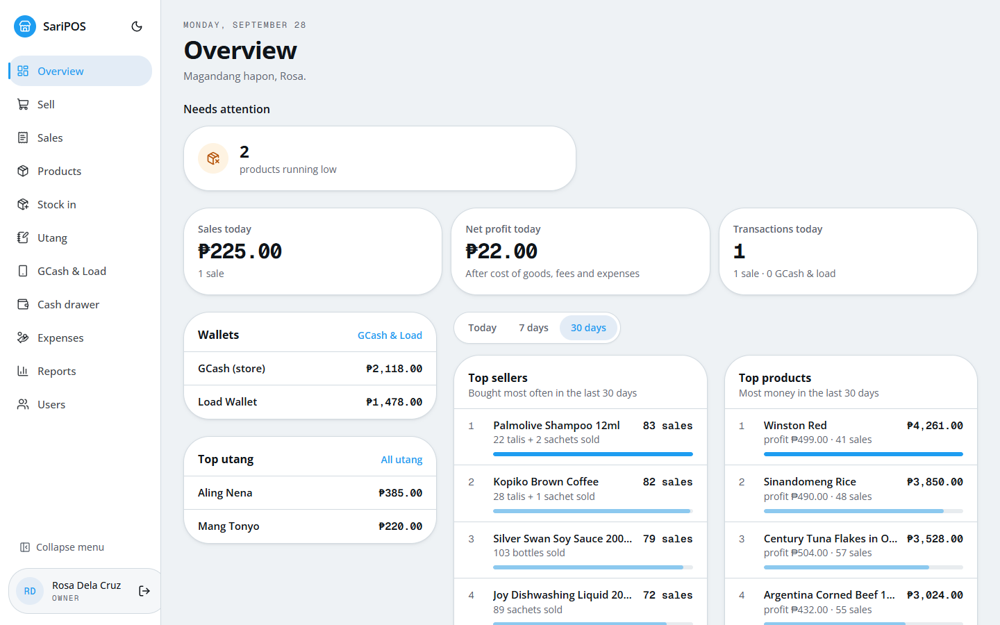
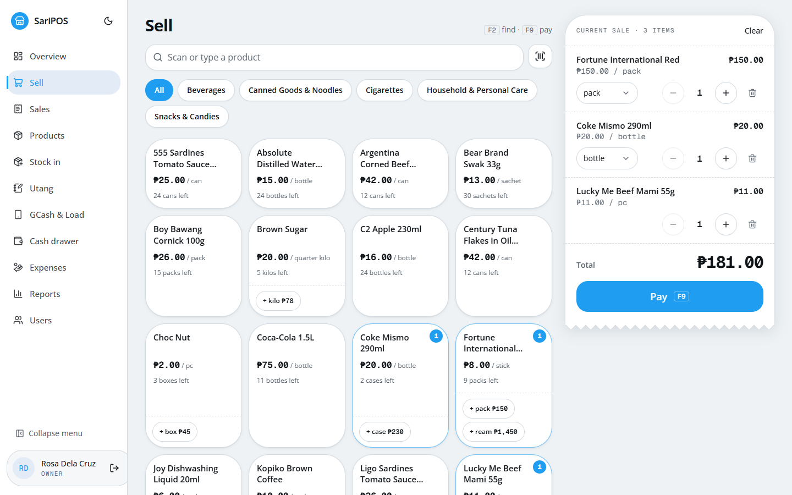
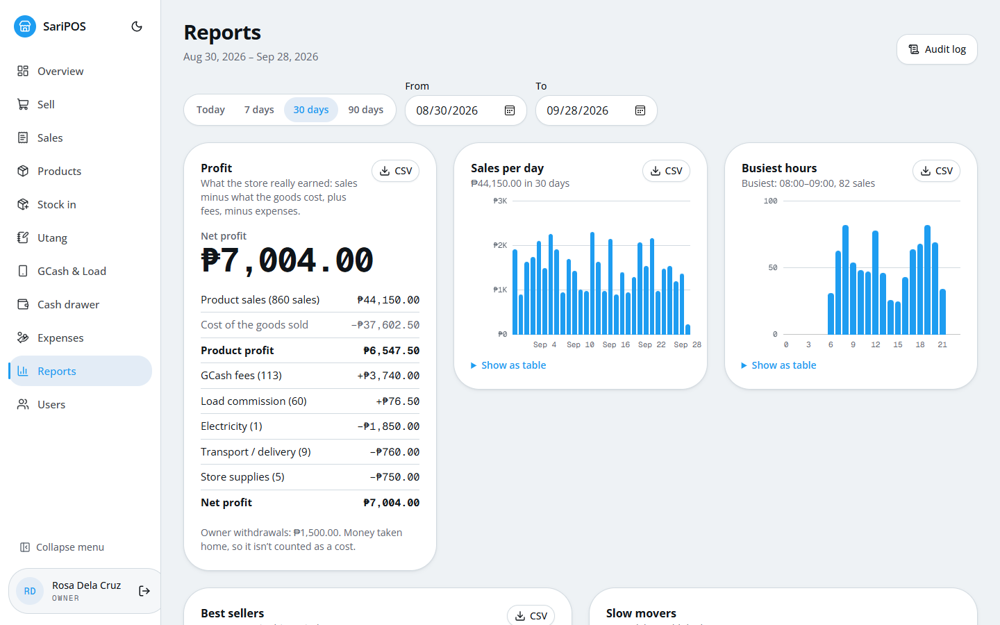
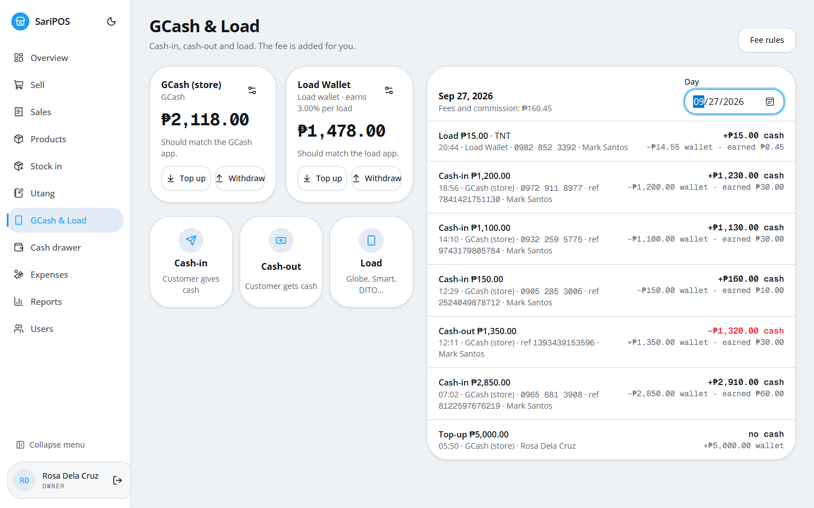
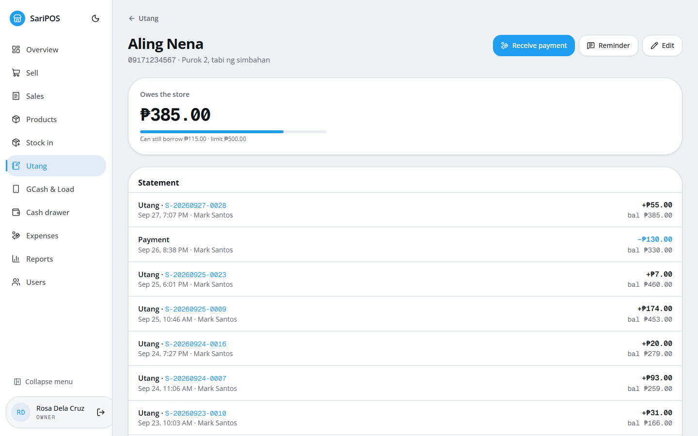
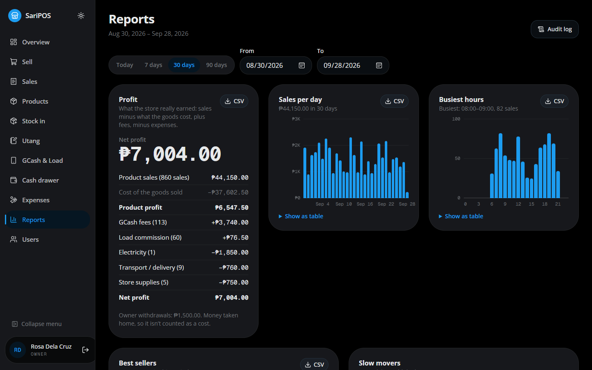
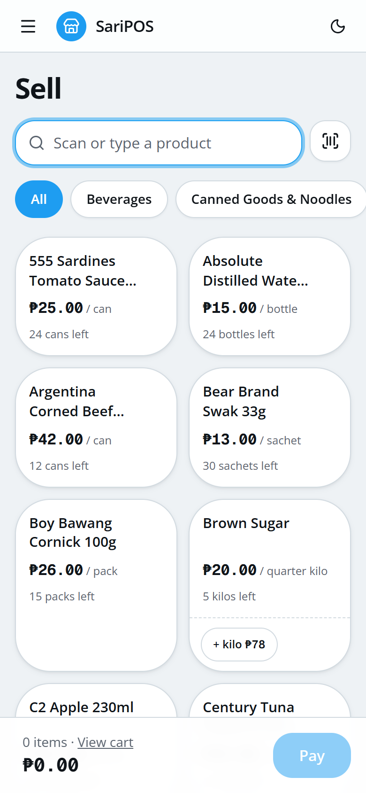
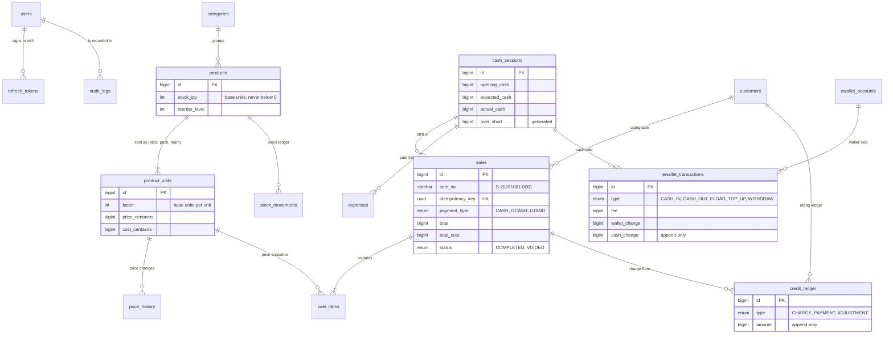

# SariPOS

A point-of-sale system for Philippine sari-sari stores: selling by the piece (*tingi*), credit for regular customers (*utang*), GCash and e-load, the cash drawer, and profit reports. Built with PostgreSQL, Express, React and Node.js in TypeScript.

<!-- After deploying (docs/DEPLOY.md), replace the link below with your Vercel URL. -->
**Live demo:** https://saripos.vercel.app. On the login page, tap **As owner** or **As cashier**. The demo is a sample store with 30 days of sales and resets every night.



## What it does

| | |
|---|---|
| **Sell fast** | Tap tiles, search, or scan a barcode with a USB scanner or the phone camera. One product can be sold several ways: a stick, a pack or a ream of cigarettes all come out of one stock count. Cash, GCash or utang. |
| **Utang** | Per-customer credit limits, a statement like a passbook, partial payments, a text-message reminder, and an aging report (who owes, for how long). |
| **GCash & load** | Cash-in, cash-out and e-load with the fee worked out for you. Tracks both "pockets" (the e-wallet balance and the cash drawer), so both reconcile at the end of the day. |
| **Cash drawer** | Start of day, expenses paid from the drawer, and an end-of-day blind count: the cashier counts before seeing the expected amount, and the over/short is computed by the database. |
| **Reports** | Real profit: sales minus cost of goods, plus GCash fees and load commission, minus expenses. Sales per day, busiest hours, best sellers and slow movers, all exportable to CSV. |
| **Owner controls** | Two roles (owner and cashier). Voids need the owner's PIN. Every void, price change, stock adjustment and failed login is kept in a tamper-proof audit log. |

| | | |
|---|---|---|
|  |  |  |
|  |  |  |

## Tech stack

| Layer | |
|---|---|
| Frontend | React 19, Vite, TypeScript, Tailwind CSS v4, shadcn/ui, TanStack Query, React Hook Form + Zod |
| Backend | Node.js 24, Express 5, TypeScript, Zod, raw parameterized SQL with `pg` (no ORM) |
| Database | PostgreSQL 17 with SQL migrations (node-pg-migrate) |
| Auth | argon2id, 15-minute JWT access tokens held in memory, rotating refresh tokens in httpOnly cookies |
| Tests | Node's built-in test runner (unit tests plus API integration tests against a real database), Vitest, Playwright |
| Hosting | Vercel (web app), Render (API), Neon (PostgreSQL), GitHub Actions (CI and the nightly demo reset) |

```
browser ──HTTPS──▶ Vercel ── static React app
                     │  /api/* forwarded (same site, so the login cookie stays first-party)
                     ▼
                  Render ── Express API ──TLS──▶ Neon PostgreSQL
```

## Security

Designed against the OWASP Top 10 ([plan, section 8](SariPOS-Project-Plan.md)). Each item below is covered by an automated test ([security.test.ts](server/src/tests/security.test.ts)) or a browser check.

- **Access control on the server:** role checks on every route. A cashier only sees the current shift, and asking for another shift's sales returns *not found*.
- **Money can't be tampered with:** prices, fees and totals always come from the database. A request saying `unitPrice: 0` is ignored.
- **Double-tap safe:** every sale, payment and GCash transaction carries an idempotency key, so five identical requests at once make one sale.
- **Ledgers, not edits:** stock, utang and e-wallet history are append-only. The database itself refuses updates and deletes, and a mistake is fixed with a new reversing row.
- **Database rules:** CHECK constraints enforce, for example, that the total equals subtotal minus discount, that every utang charge comes from a real sale, and that the cash math of each GCash transaction type is right. The script `npm run db:check` proves the database rejects 36 kinds of bad data.
- **Accounts:**
  - Passwords and PINs are hashed with argon2id.
  - Logins are rate-limited per IP and username, and an account locks after 5 wrong passwords.
  - Refresh tokens are stored as hashes, work once, and reusing an old one signs out every session of that user.
- **No token in reach of scripts:** the access token lives only in memory, the refresh token in an httpOnly, SameSite=Strict cookie. Nothing is kept in localStorage.
- **Injection:** all SQL is parameterized, and all input is validated with Zod at the API edge.
- **XSS:** React escapes all text, and a strict Content-Security-Policy (script hashes, no `eval`) blocks injected scripts even if HTML got in.
- **Headers and dependencies:** helmet, a strict CORS origin, no `x-powered-by`, a 100 kB body limit, `no-store` caching, and a general rate limit. Dependabot and `npm audit` run in CI.

## Database



All money is stored as whole centavos (`BIGINT`), never as floating point.

## Run locally

You need Node.js 24 and Docker Desktop.

```bash
docker compose up -d                 # Postgres 17 on localhost:5433

cd server
cp .env.example .env                 # then fill in JWT_ACCESS_SECRET and the SEED_* values
npm install
npm run migrate:up
npm run seed                         # wipes the DB and loads sample data (dev only)
npm run db:check                     # proves the DB rejects bad data (changes nothing)
npm run dev                          # API on http://localhost:4000

cd ../client
cp .env.example .env
npm install
npm run dev                          # http://localhost:5173
```

Generate the secret with `openssl rand -base64 48`. Log in as `owner` or `cashier` with the `SEED_*` passwords you chose. `npm run seed:demo` loads the demo store instead: users `owner_demo` and `cashier_demo`, plus 30 days of history.

The database runs on port **5433**, not 5432, so it doesn't clash with a local PostgreSQL install. It only listens on `127.0.0.1`, and the API connects as `saripos_app`, a normal (non-superuser) role created by [db/init/01-app-role.sql](db/init/01-app-role.sql). That script runs only when the Docker volume is first created. To re-run it, use `docker compose down -v`, which deletes all DB data.

## Tests

```bash
cd server
npm test        # unit + API integration tests (incl. the self-pentest) against saripos_test
cd ../client
npx vitest run  # client unit tests
```

The API tests wipe and re-seed a **separate** database, `saripos_test`, set with `TEST_DATABASE_URL` in `server/.env`. They refuse to run against a database whose name doesn't end in `_test`. New Docker volumes create it automatically ([db/init/02-test-db.sql](db/init/02-test-db.sql)). On an existing volume, run this once:

```bash
docker exec -i saripos-db-1 psql -U postgres < db/init/02-test-db.sql
```

GitHub Actions runs everything (lint, types, tests, `npm audit`) on every push: [ci.yml](.github/workflows/ci.yml).

## Migrations

| Command | What it does |
|---|---|
| `npm run migrate:up` | Apply all pending migrations |
| `npm run migrate:down` | Roll back the last migration |
| `npm run migrate:down -- 99` | Roll back everything |
| `npm run migrate:create <name>` | New SQL migration in `server/migrations/` |

## Deploy

Step by step, with free tiers: [docs/DEPLOY.md](docs/DEPLOY.md).
